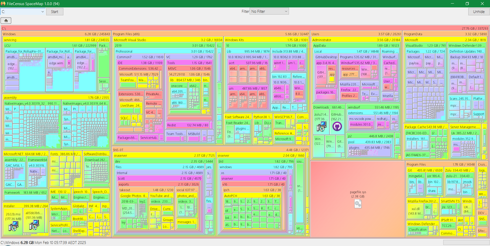

# FCSpaceMap

A powerful filesystem visualization tool that helps you understand and analyze disk space usage through interactive treemaps.



## Features

- **Interactive Treemap Visualization**: Displays disk space usage in an intuitive, hierarchical format
- **Cross-Platform Support**: Works on Windows, macOS, and Linux with native look and feel
- **Smart Font Selection**: Automatically selects appropriate system fonts based on platform and locale
- **Customizable Display**:
  - Toggle free space visibility
  - Filter view options
  - Interactive hover information
  - Dark mode title bar

## Requirements

- Java Runtime Environment (JRE) 8 or later
- Maven for building from source

## Building from Source

1. Clone the repository
2. Build using Maven:
```bash
mvn clean package
```

## Usage

1. Launch the application
2. Use the toolbar to select a drive or directory to scan
3. The treemap will display with:
   - Larger rectangles representing larger files/directories
   - Color coding for different directory depths
   - Hover information for detailed file/directory information
   - Free space indication (toggleable)

## Controls

- **Scan**: Start scanning a selected drive or directory
- **Toggle Free Space**: Show/hide free space in the visualization
- **Filter Panel**: Apply filters to focus on specific file types or sizes
- **Hover**: Move mouse over items to see detailed information

## License

FCSpaceMap is licensed under the GNU General Public License v3.0. See the [LICENSE](LICENSE) file for details.

## Credits

Developed by Intermine Pty Ltd. Copyright 1997-2025
